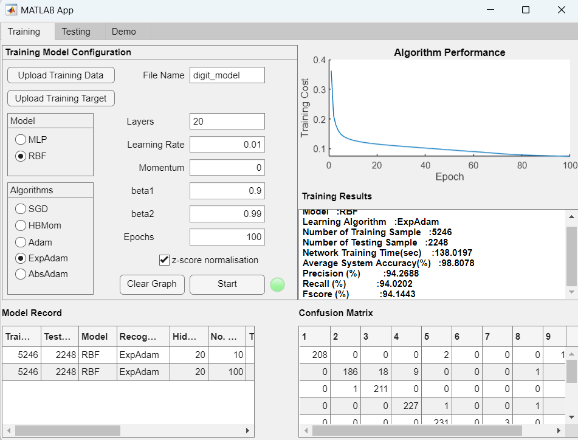
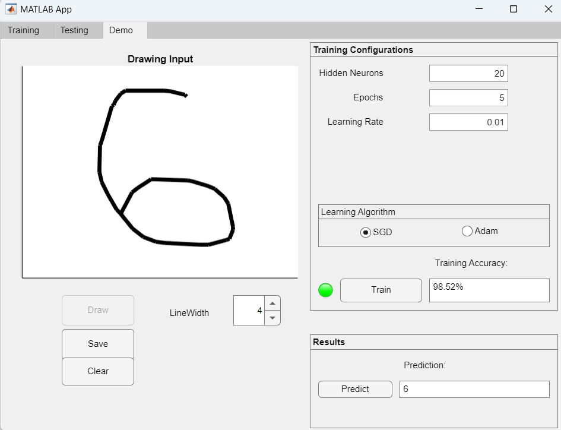
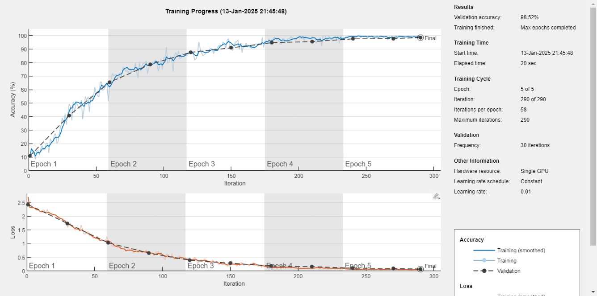
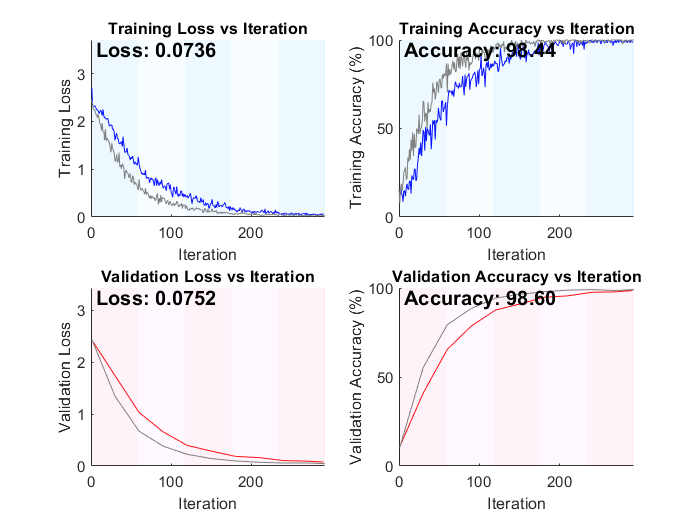

# SGD_demonstration
 
This project provides a GUI to demonstrate the various Stochastic Gradient Descent (SGD) algorithms used in training neural networks. It was awarded Gold Prize in Undergraduate Research Opportunities Program (UROP) at the Chinese University of Hong Kong (CUHK) and hence publicly used in sharing seminars at CUHK.

---

## Contributions
- Hardcoded all training process, catering various types of network architectures and learning algorithms. 

- Demonstrated the network training for beginners in an interactive GUI.


---
## Features
### Training Panel


**Training Panel**:
  - Train models using various neural network architectures (MLP and RBF).
  - Compare different optimization algorithms (SGD, Adam, momentum, ExpAdam, AbsAdam).
  - Real-time visualization of training loss, confusion matrix, and performance metrics.
  - Compare models on key metrics (accuracy, recall, precision, F1 score).

By repeating the above steps, users can compare the performance of different models in the bottom left.

The training datasets should be placed under the `dataset`. Sample datasets (inputs and targets) have been provided for MNIST and letter from UCI directory.

The trained models are stored in `training/model`.

Similar performance testing can be conducted on the `Testing` panel.

**Demo Panel**:

  - Train a simpler model interactively with fewer configurations.
  - Visualize training progress and validation results in real-time.
  - Test trained models with handwritten digit recognition.

For beginners, they are enabled to customize simpler version for a more interactive experience. 

They can choose between SGD and Adam as their learning algorithm. When "Train" is pressed, new windows of training record and validation results pop up.





By training multiple models, comparisons of training progress are also displayed.

After training the model, the users can use try to recognise their handwritten digit.


---

## How to use
1. Clone the repository:
   ```bash
   git clone https://github.com/username/SGD_demonstration.git

2. Open MATLAB and navigate to the directory:
    ```matlab
    cd NetworkTrainingSimulation/for_testing/
    ```
3. Run the app:
    ```matlab
    open('NetworkTrainingSimulation.mlapp')
    ```

---
## Requirements
- MATLAB R2022a or later
- Neural Network Toolbox